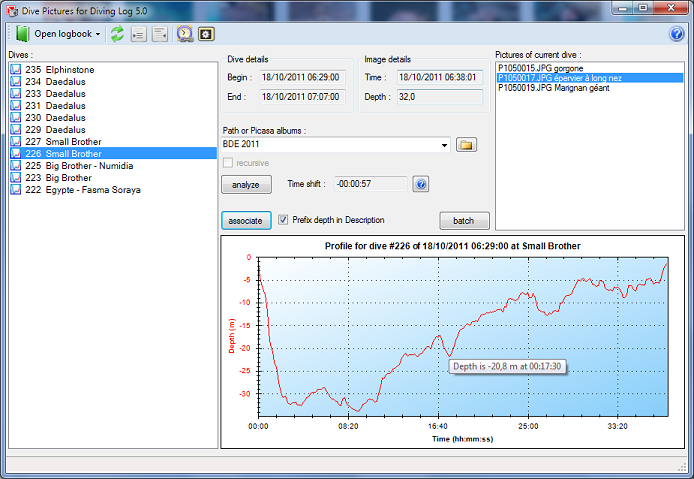

# DivingLog Extensions

Some code I have written years ago for [DivingLog](http://www.divinglog.de) in C# with [Visual Studio](https://www.visualstudio.com/).

They won't compile _as is_, because of the lack of external dependencies and differences with the current version of C# dev env.

## Pictures

> [Original post](http://www.divinglog.de/phpbb/viewtopic.php?f=10&t=1603)

_Additional processing for underwater pictures_

Here is another extension for Diving Log. This allows you to do some additional processing with your underwater pictures.

#### Story
A few time ago, I wrote a tool for my own needs to add the depth and the place name into underwater pictures. I finally found time to make it a little more user friendly. I have merged it with another program that automates the association of a given dive with images based on the shooting time.

As this may be of interest to others, I decided to make it public.

#### Description

This program loads the dives of the current logbook with their profiles. You can select only some dives to limit the analysis.

Then you select a Picasa album (if you have one) or a path on your hard disk where the images are stored.

The analyze button will find all pictures that belong to the displayed dives. The algorithm uses the camera time, not the file time. 

So, it is recommended, if possible, to calculate the shift between the clock of your camera and the dive computer.

Here is an example (I just shot my dive computer displaying its time with my underwater camera) :

When analysis is done, you can associate the pictures with dives in the Diving Log database. Optionally you can preprend the depth in the description (hope a depth column will be added soon !). A confirmation window is displayed before the updates are made.

The program will only modify the Pictures table with updating or adding records. All other tables are unchanged.

#### Advanced usage
Alternatively, and for advanced/geek users, you can generate a batch (e.g. a script) to process the pictures with depth and site information.

Two dialogs are dedicated to this feature: the pattern creation (syntax in the ? button)

and the resulting batch (which can be saved or copied to the clipboard)

As example, here is the result for my last liveabroad in Red Sea. I used ImageMagick to overlay the depth, the site and a little picture (my diver timestamp...) in the images.

Be careful not to delete or modify original image files with bad commands. I strongly recommend to carefully read the manual of ImageMagick or exiftool or any other command line tool used and do some tries before applying the batch to a whole directory.

#### Installation
The setup program is here (thanks to AndyDragon). All dependencies will be automatically downloaded : Microsoft Framework .NET 4 and Visual C++ 2010 runtime. Yes, the complete Framework .NET 4, not only the client profile version (due to the Scintilla control).

The initial public version is 1.1.0.9.

The first time you launch the program it will register itself with Diving Log as an External Tool. Updates will be downloaded automatically when available.

Please backup your logbook before using this tool.

It works fine on Windows 7. On XP, IPTC titles are not extracted from images, I don't know why.

Sorry, only metric system for now. But if they loudly insist, I will take care of my anglo-saxon friends :P In exchange, they can correct my mistakes in English !

#### Disclaimer

THE SOFTWARE IS PROVIDED ""AS IS"", WITHOUT WARRANTY OF ANY KIND, EXPRESS OR IMPLIED, INCLUDING BUT NOT LIMITED TO THE WARRANTIES OF MERCHANTABILITY, FITNESS FOR A PARTICULAR PURPOSE AND NONINFRINGEMENT. IN NO EVENT SHALL THE AUTHORS OR COPYRIGHT HOLDERS BE LIABLE FOR ANY CLAIM, DAMAGES OR OTHER LIABILITY, WHETHER IN AN ACTION OF CONTRACT, TORT OR OTHERWISE, ARISING FROM, OUT OF OR IN CONNECTION WITH THE SOFTWARE OR THE USE OR OTHER DEALINGS IN THE SOFTWARE.

The program is not related to Diving Log neither its author.

## SyncLogbook

> [Original post](http://www.divinglog.de/phpbb/viewtopic.php?f=10&t=1583)

_Synchronize countries,places, etc. between two logbooks_

I have written a little program to help people that maintain two or more logbooks (it's my case...) that smartly synchronizes some information between a master logbook and a slave one.

The involved tables are : Country City Place Shop Trip

The program **does not** delete rows that are not in the master logbook. It **adds** only rows that are not in the slave one or **updates** older rows.
The algorithm is based on the UUID and Updated columns and is fair with table IDs.

You can download the binary [here](http://www.opencircuitscuba.com/downloads/rene/DL5SyncLogbook/).

It requires the [Microsoft Framework .NET 4](http://www.microsoft.com/download/en/details.aspx?id=17113).

As you can guess : THE SOFTWARE IS PROVIDED ""AS IS"", WITHOUT WARRANTY OF ANY KIND, EXPRESS OR IMPLIED, INCLUDING BUT NOT LIMITED TO THE WARRANTIES OF MERCHANTABILITY, FITNESS FOR A PARTICULAR PURPOSE AND NONINFRINGEMENT. IN NO EVENT SHALL THE AUTHORS OR COPYRIGHT HOLDERS BE LIABLE FOR ANY CLAIM, DAMAGES OR OTHER LIABILITY, WHETHER IN AN ACTION OF CONTRACT, TORT OR OTHERWISE, ARISING FROM, OUT OF OR IN CONNECTION WITH THE SOFTWARE OR THE USE OR OTHER DEALINGS IN THE SOFTWARE.

Please backup you logbooks before trying this program.

## GeoTag

> [Original post](http://www.divinglog.de/phpbb/viewtopic.php?f=10&t=1560)

_Use Google Earth to geotag the dive sites_

I have wrote a little program that uses Google Earth as Picasa does for geotagging dive sites (e.g. set their GPS location). It differs from the Diving Log 5.0 built-in feature because, here, you use Google Earth to get the coordinates.

You can retrieve the location by geotagging (the program launches Google Earth and displays a crosshairs plus a little window in the bottom right corner to accept the location or cancel the operation.

You can also set the location with the coordinates stored in the Exif. Smartphones, Lumix TZ10/20, and probably other devices add the location where picture are taken.

In the toobar, the KML button creates a .kml or .kmz file with all the dive sites and their descriptions. Save button commits the modifications, and the Undo rollbacks the current site. If you want to cancel all the modifications, close the program and relaunch it.

This tool is an external tool to Diving Log 5.0. The simplest solution it is to confirure it as an external tool call it when needed. With this tool, you can set only some parameters of the dive site (lat, lon, alt, depth, rating and comments). You can not create or delete sites: this must be done in Diving Log 5.0.

Altitude and depth are calculated from Google Eearth: if the altitude of the targetted point is negative, it becomes the depth and altitude is set to 0. It may be a bit hazy, I know :)

You can download it here : DL5GeoTag.zip. You have to unzip the both files in the directory of your choice (for example C:\Program Files (x86)\Diving Log 5.0\DL5GeoTag) and to launch it at least once. It will display a warning and configure the external tool in Diving Log.

In the [project page](http://code.google.com/p/google-earth-tagging/), you will find how I handled the Earth COMAPI. (Only for interested geeks...)

It requires the .NET Framework 4 Client Profile which has to be downloaded from the Microsoft site : Web install or Standalone install.

And, of course, Google Earth. But, in fact, Google Earth is not essential if you geotag only from jpeg.

THE SOFTWARE IS PROVIDED ""AS IS"", WITHOUT WARRANTY OF ANY KIND, EXPRESS OR IMPLIED, INCLUDING BUT NOT LIMITED TO THE WARRANTIES OF MERCHANTABILITY, FITNESS FOR A PARTICULAR PURPOSE AND NONINFRINGEMENT. IN NO EVENT SHALL THE AUTHORS OR COPYRIGHT HOLDERS BE LIABLE FOR ANY CLAIM, DAMAGES OR OTHER LIABILITY, WHETHER IN AN ACTION OF CONTRACT, TORT OR OTHERWISE, ARISING FROM, OUT OF OR IN CONNECTION WITH THE SOFTWARE OR THE USE OR OTHER DEALINGS IN THE SOFTWARE. And it is not related to Diving Log neither its author.

I have tested on my PC with Windows 7 64-bit Pro and Google Earth 6.0.3.2197.

Maybe this tool will become obsolete one day... :)
